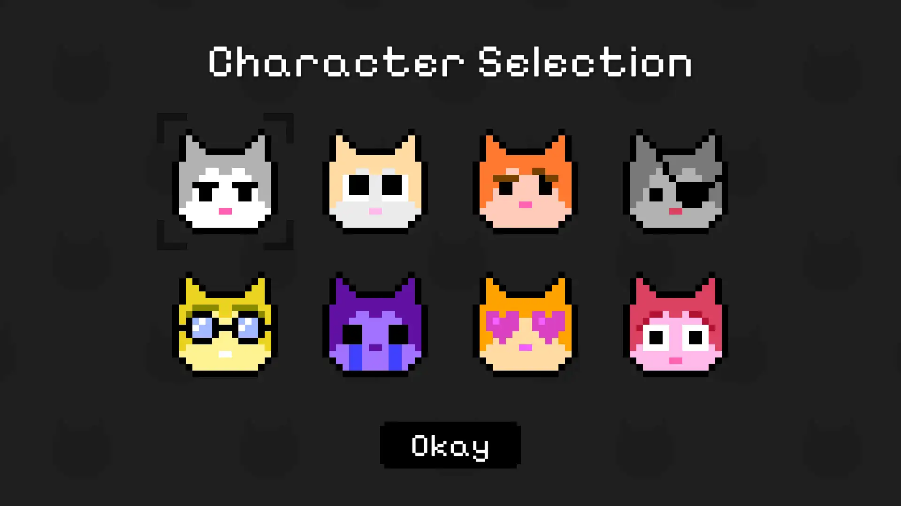
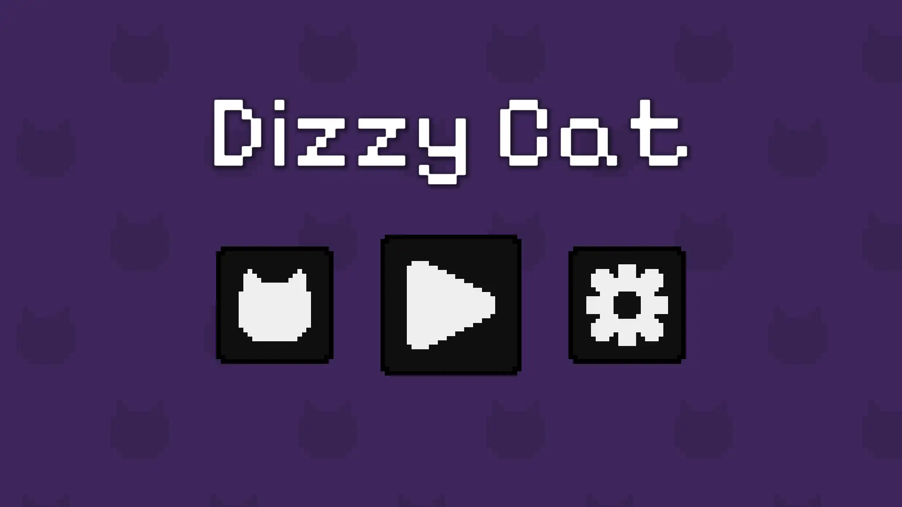
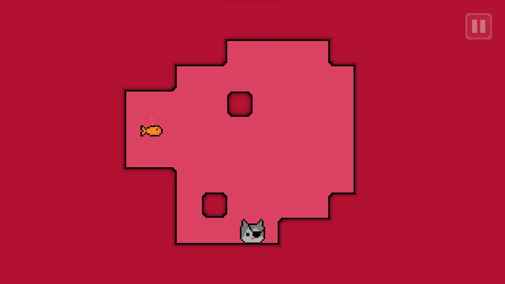

# Dizzy Cat

Help a little cat reach its beloved fish by rotating the world around it. Dizzy Cat is a pixel art puzzle platformer that puts a twist on how you move through levels.

🎮 Rotate. Think. Rotate again. Meow in frustration. Repeat.

## 🐾 Features
- 🧠 10 handcrafted puzzle levels that get trickier as you go.
- 🔐 Key and lock mechanics in later levels to mess with your brain just a little more.
- 🐱 Select your favorite cat.
- 🎥 Static camera, rotating madness.

## 📷 Screenshots

## 🎮 Controls
**Rotate the world:**
- Keyboard: A / D or Arrow Keys
- Gamepad: Left joystick
- Mobile: Tap left or right sides of the screen

**Pause the game:**
- Keyboard: Escape
- Gamepad: Start
- Mobile/Web: On-screen pause button

## 💻 Tech Stack
Built using:
- Unity 2021.3.20f1
- C#
- DOTween
- LibreSprite